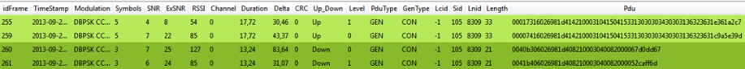
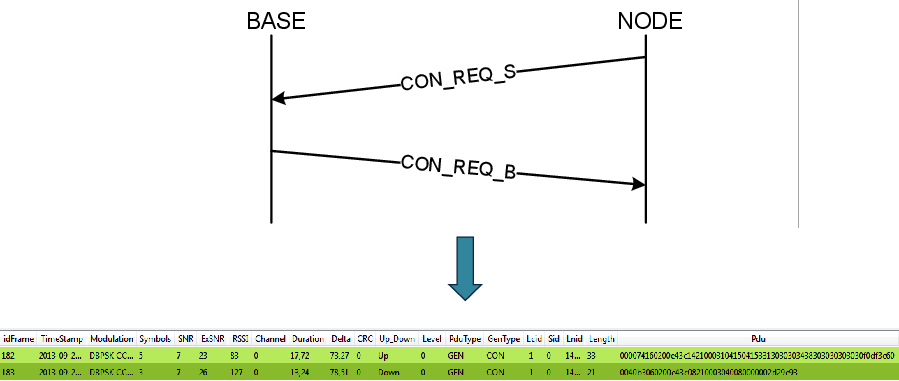
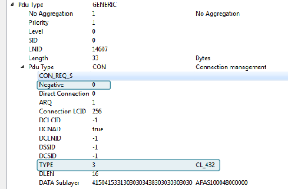
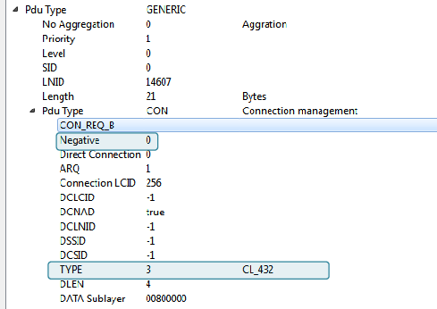

# SN Connection Establishment

This is the diagram that appears in the PRIME specification 1.3.6 showing the connection establishment process initiated by a Service Node. It shows how the Service Node sends a connection request to the Base Node via another switch.

The sniffer capture according to the above PRIME specification diagram is the following:

The other sniffer capture shown below shows the connection establishment process initiated by a Service Node but in this case, there is not any intermediate switch, so there are only 2 devices involved: the Base Node and the terminal or Service Node. The next image shows the connection establishment process with the 2 frames involved:

In order to obtain more details, if you go to the *packet view*, it is possible to find the type of messages and associate them with the previous diagram \(In this case is a 4-32 connection\):

-   Frame 182:

    

-   Frame 183:

    

**Note:** As the Negative field is equal to 0, it indicates that it is a connection opening. When Negative field is equal to 1, it indicates that is a connection closing.

**Parent topic:**[Appendix C. PRIMEv1.3 Use Case Examples](GUID-373ECDE6-AFFD-44B5-AE97-7CF1A8FCC4AD.md)

