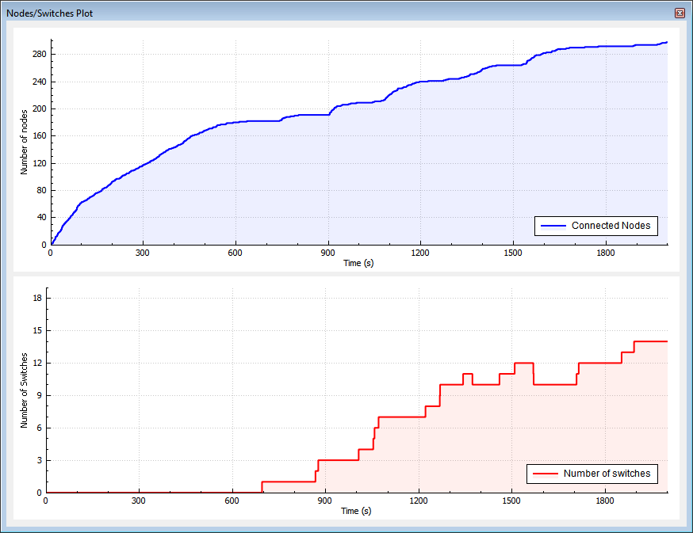
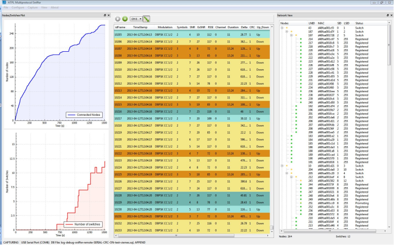

# PRIME Nodes/Switches Plot View

This window shows the evolution of the network as seen by the sniffer. It plots the number of active nodes and switches on the network versus time, and is useful to detect problems of stability on the PLC network. Use the mouse wheel to zoom in and out.

[Figure   1](GUID-0884B0D5-3059-4568-A878-E50D175DB793.md#ID-FIG-00000007) shows the network structure of a PLC network and how it has evolved after a reboot of the Base Node.

**Parent topic:**[PRIME](GUID-629FBCB3-9AE6-41A9-904E-39EBF5C9A78F.md)

