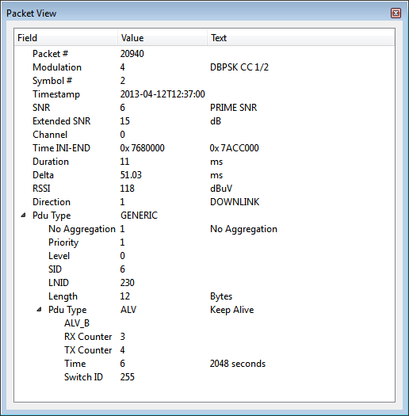

# PRIME Packet View

This view shows the disassembled data of the frame selected in the main window. All the fields specified on the PRIME specification are shown.

**Parent topic:**[PRIME](GUID-629FBCB3-9AE6-41A9-904E-39EBF5C9A78F.md)

