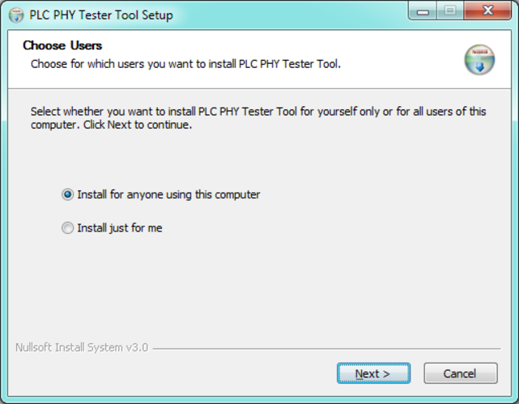
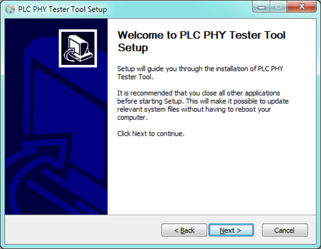
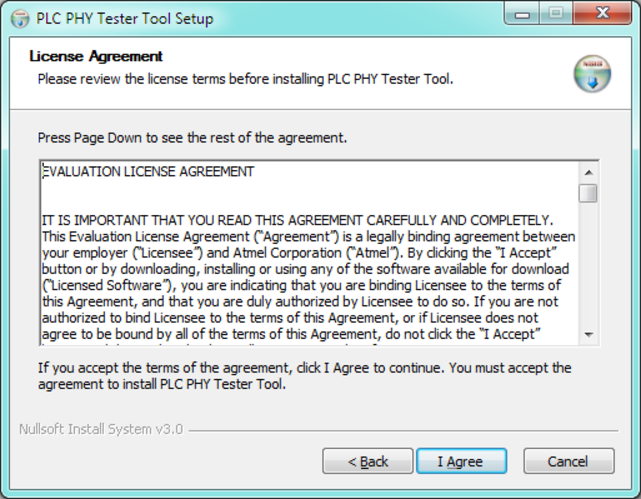
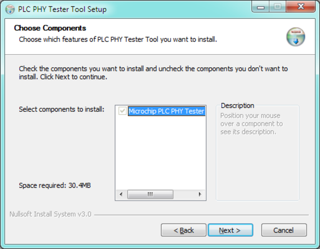
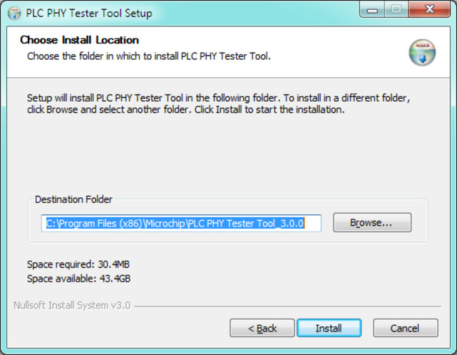
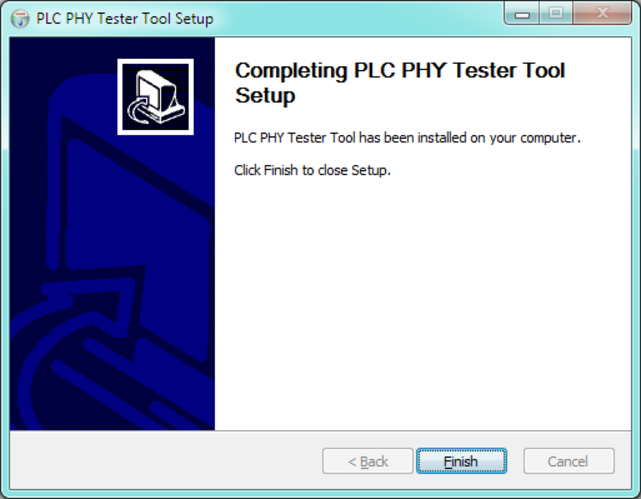

# Software Installation

To install the software, execute the installation wizard provided. The first window allows selecting between multi-user support and current user:

Next window is the welcome window and contains some advice about tool installation:

The next window shows you the License Agreement:

Next, select the components to install:

And finally, select the install location:

The wizard must complete without any other configuration:

The installation procedure generates a desktop link and start menu entry. Use either to start the tool. In order to be able to connect to the Microchip PLC boards, USB drivers are provided with this software. Please be sure that these drivers are installed before using this tool.

**Parent topic:**[PHY Tester Tool](GUID-86D38A8C-38A8-49D6-AF95-1E62D0A94EF2.md)

