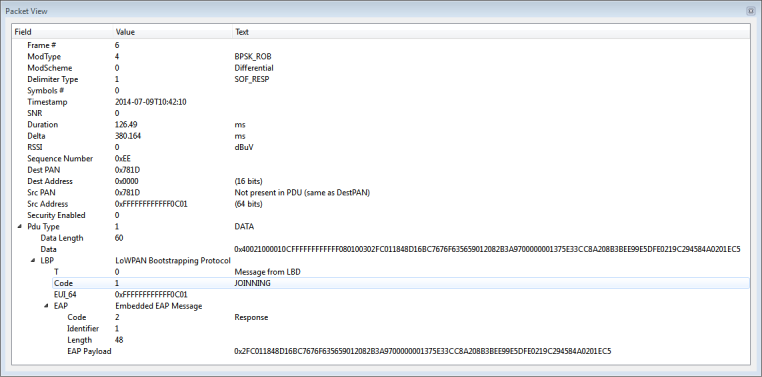

# G3-PLC Packet View

This view shows the disassembled data of the frame selected in the main window. All the fields specified on the G3-PLC specification are shown.

**Parent topic:**[G3-PLC](GUID-AEF828B2-7BEE-47DA-84FC-8959348255B2.md)

