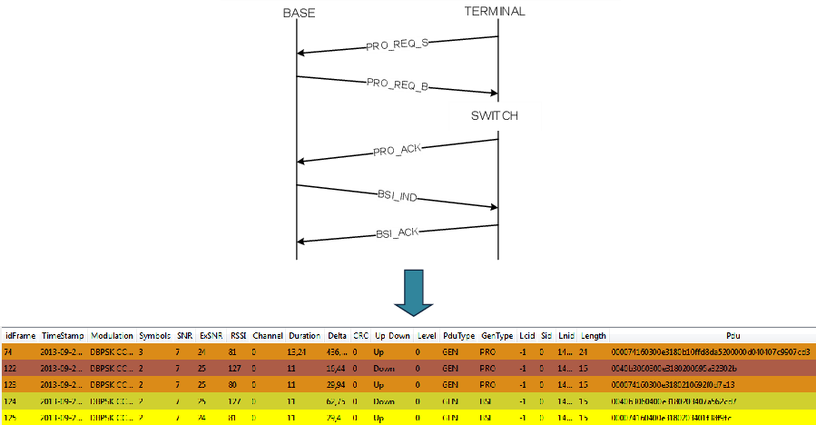
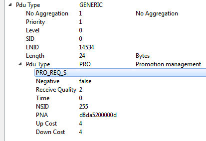
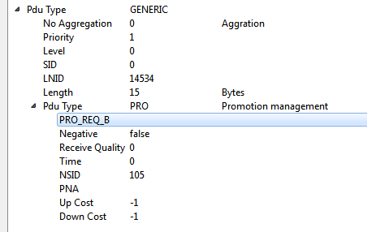
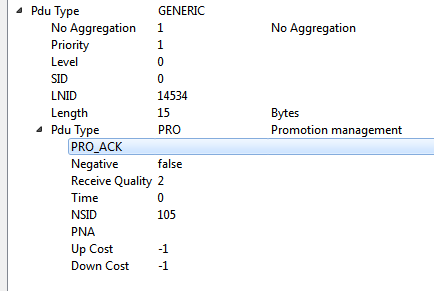
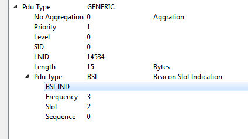
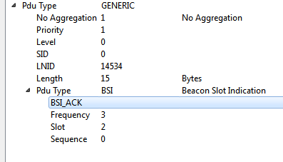

# SN Promotion Process

This is the diagram that appears in the PRIME specification 1.3.6 showing the promotion process initiated by a Service Node. It shows how the Service Node sends a promotion request to the Base Node via another switch.

The sniffer capture shown below shows the promotion process initiated by a Service Node but in this case, there is not any intermediate switch, so there are only 2 devices involved: the Base Node and the terminal or Service Node. The next image shows the promotion process with the 5 frames involved.

In order to obtain more details, if you go to the *packet view*, it is possible to find the type of messages and associate them with the previous diagram:

-   Frame 74:

    

-   Frame 122:

    

-   Frame 123:

    

-   Frame 124:

    

-   Frame 125:

    

**Parent topic:**[Appendix C. PRIMEv1.3 Use Case Examples](GUID-373ECDE6-AFFD-44B5-AE97-7CF1A8FCC4AD.md)

