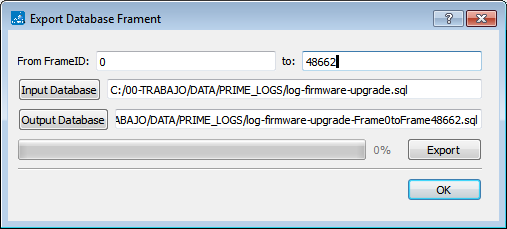

# Import and Export Databases

PLC Sniffer can import logs from old AddSemi tools into a new database file. Also, databases can be created from raw dump files from an embedded sniffer.

The export database feature has been introduced to help working with big databases \(hundreds of Megabytes\). In this kind of logs, typically only a fraction of the database is needed to be analyzed. Dealing with smaller databases will make the tool faster and will use fewer memory resources. This might be important in old and slow computers.

These features will not work if a Capture is in process.

Log’s Network view of the exported database might be different from the original database. It will only show information available in the exported fragment.

-   **[Rebuild Databases](GUID-C2CB215D-3AE9-443C-BA05-01CC14A67100.md)**  

**Parent topic:**[PHY Sniffer](GUID-8D66ECA9-8C74-42B9-8915-33D381579FBB.md)

