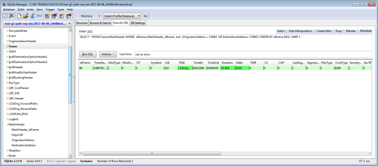

# Sample SQLite Filters

Relational databases allow complex data searches using the SQL language. The SQLite log database is open and can be queried with any tool that can handle SQLite v3.0 files. [Figure   1](#ID-FIG-00000014) shows the SQLite Manager Firefox add-on. This tool can be used to query sniffer databases. It is also possible to query the database using any scripting language with SQLite bindings such as Python. Following are a few examples of how to query the database.

-   **[How Many Times a Node Has Joined to the Network](GUID-2D8C92F7-BF6F-41C1-A51E-0903BB945E9C.md)**  

-   **[Last Data Communication with a Node](GUID-2ADC0446-33A7-4D75-BB69-6487C6367907.md)**  

-   **[Last Path Update for a Device](GUID-93310D57-DE98-40F6-9887-031881730143.md)**  

**Parent topic:**[Appendix B. G3-PLC SQLite Log Database](GUID-B1D36D7B-7A26-4B4E-B5DB-E314EF9CEF9F.md)

