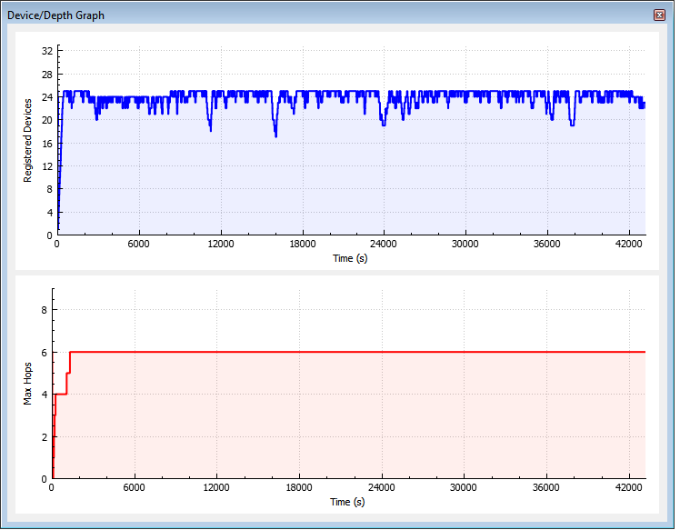

# G3-PLC Device/Depth Graph View

Based on the information learned from the analysis of the bootstrap protocol and routing Mesh Header, this tool is able to produce a graph with the number of nodes currently connected to the network and the maximum depth reached \(maximum number of hops to reach any device in the network\).

**Parent topic:**[G3-PLC](GUID-AEF828B2-7BEE-47DA-84FC-8959348255B2.md)

