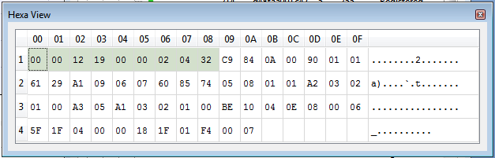

# PRIME Hexa View

This view shows the hexadecimal display of the frame selected in the main view. Parts of the message identified as the header and CRC on the protocol are colored. If CRC option is enabled, the CRC data is not shown.

**Parent topic:**[PRIME](GUID-629FBCB3-9AE6-41A9-904E-39EBF5C9A78F.md)

