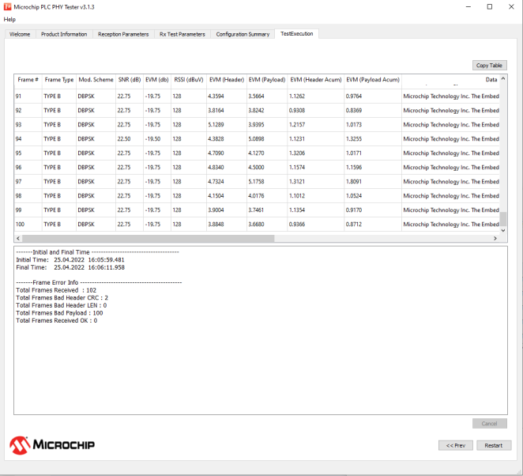
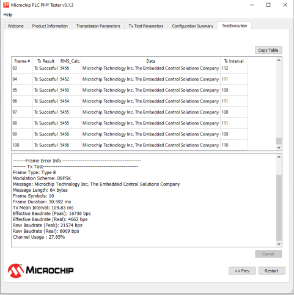

# Test Execution Tab

This is the tab shown while the test is being executed; it shows the transmission or reception of each message in form of a table. The following figures show examples of this tab for transmission and a reception tests:

Both views \(Tx and Rx\) show tables representing different information depending on test type \(transmission/reception\). When the test is finished or is cancelled, a final report is shown at the bottom of the tab.

This tab will provide additional information about signal quality in case of selecting "Performing EVM Test" check-box in the "Reception Parameters" tab.

The user can copy the information included in the corresponding table to the clipboard by clicking on the "Copy Table" button. This tab is only able to hold the information of the last 10000 frames; the user can choose a bigger number of frames to be transmitted/received but only the last 10000 frames will be available.

1.  **Reception Test Results**

    

    Information included in the table is as follows:

    -   Frame \#: Indicates the received frame number
    -   Frame Type: Indicates the frame type: Type A, Type B and Type BC.
    -   Modulation Scheme: Indicates if modulation scheme
    -   SNR \(dB\): Signal-to-Noise ratio calculated as PRIME 1.4 Spec
    -   EVM \(dB\): Error Vector Magnitude calculated as PRIME 1.4 Spec
    -   RSSI \(dBuV\): Indicates the strength of the received signal in dBuV
    -   Data: Is the received info in ASCII format
    -   Rx Interval: Is the interval of time between the reception of the current frame and the previous one
    -   Payload Integrity: Shows if the content of the frame is correct or not
    After all frames have been received, or the test has been cancelled, a text box with information about the test will be shown at the bottom of the tab. First of all, test timestamps are shown; this information is measured by the PC application. After that, there is a section called Frame Error information that shows information about received frames and possible errors. Fields shown in this section are:

    -   Total Frames Received: Shows the number of frames detected, not taking into account if the frame has errors
    -   Total Frames Bad Header CRC: Shows the number of frames in which the header CRC8 is not valid. These frames are discarded by the firmware and are not reported in the application
    -   Total Frames Bad Header LEN: Shows the number of frames in which the header LEN is not correct. These frames are discarded by the hardware and are not reported in the application
    -   Total Frames Bad Payload: Shows the number of frames where the content of the payload is not what it is supposed to be
    -   Total Frames Received OK: Shows the number of frames received with the correct content
2.  **Transmission Test Results**

    

    There are eight columns that show the following information:

    -   Frame \#: Indicates the number of frames transmitted. It is useful to track the test progress
    -   Tx Result: Indicates the result of the transmission. If an error occurs, a descriptive text will appear
    -   RMS\_Calc: This number is related with the impedance detected in the power line; it is used by the PHY layer to determine the transmission mode.
    -   Data: Shows the message received in ASCII format
    -   Tx Interval: Represents the time interval between the current frame and the previous one
    After all frames have been transmitted, a text box with information about the test will appear at the bottom of the tab.

    Test timestamps are provided; this information is measured by the PC application. After that, there is a section of information called Frame Error information that shows information about transmitted frames and possible errors. Finally, another section shows a summary of the transmission test; apart from known transmission parameters other parameters are shown:

    -   Frame Symbols: Is the duration in symbols of the frame
    -   Frame Duration: Is the duration in millisecond of the frame
    -   Tx Mean Interval: Is the average interval between transmissions calculated from top table data
    -   Effective Baudrate \(Peak\): Is the effective baudrate if frames were transmitted consecutively, calculated as follows:

        ||

    -   Effective Baudrate \(Real\): Is the effective baudrate, calculated as follows:

        ||

    -   Raw Baudrate \(Peak\): Is the baudrate taking into account all headers that previous baudrates have not considered if frames were transmitted consecutively, calculated as following

        ||

    -   Raw Baudrate \(Real\): Is the baudrate taking into account all headers that previous baudrates have not considered, calculated as following:

        ||

    -   Channel Usage : Is the percentage of channel that has been used, calculated as follows:

        ||

**Parent topic:**[PHY Tester Tool](GUID-86D38A8C-38A8-49D6-AF95-1E62D0A94EF2.md)

