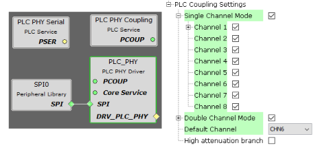

# PHY Tester Tool

The Power Line Communication \(PLC\) Physical Layer \(PHY\) Tester has been developed to allow the user to test basic characteristics of physical layers of Microchip PLC products. This tool is able to configure the different physical layers of each product with basic parameters such as modulation schemes, transmission power, baudrate, etc. in order to make the interchange of basic PLC messages possible.

The tool has been structured similar to a wizard, where each step allows the user to configure some parameters related to one aspect of the test. This structure allows the user to configure the test to be performed, and at the end of the wizard the test will start with the proper configuration chosen by the user.

It should be kept in mind that in order to obtain repeatable results, a physical test must be done under controlled condition; it is recommended to carry out the test in an isolated path free of other PLC messages or interferences that can introduce uncontrolled signals in the channel to be evaluated.

**PLC Channels Configuration**

The PHY Tester Tool application loads by default the configuration to use all the channels available in single and double modes supported by the platform. If other coupling configuration is required, it can be easily modified in PLC\_PHY module of the project graph in MPLAB Code Configurator:

-   **[Software Installation](GUID-1D9DED98-CBBD-4169-BA95-B3FFD7132E28.md)**  

-   **[General Operation](GUID-D3B009FE-474C-4B71-B364-90D9EC09B94E.md)**  

-   **[Test Execution Tab](GUID-7DDB4301-6D74-43EF-8571-0A95E879899A.md)**  

**Parent topic:**[GUID-4E178A95-8CF8-4000-9884-63540E0CB241.md](GUID-4E178A95-8CF8-4000-9884-63540E0CB241.md)

