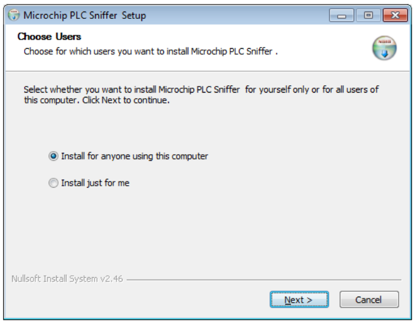
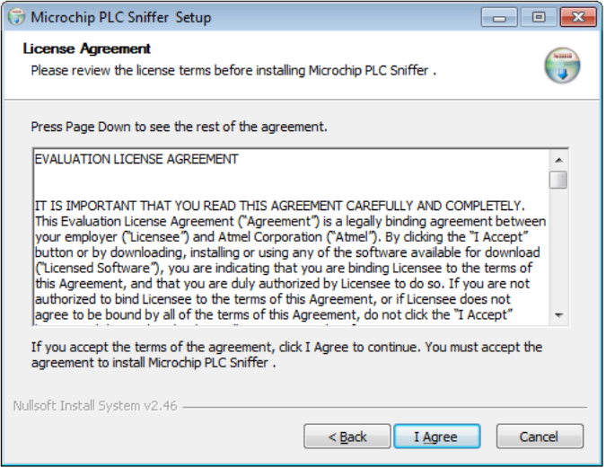
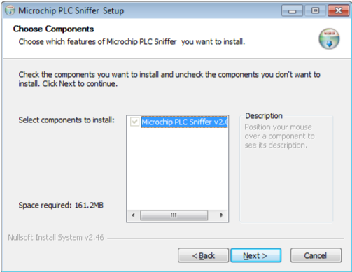
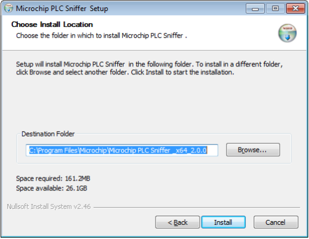
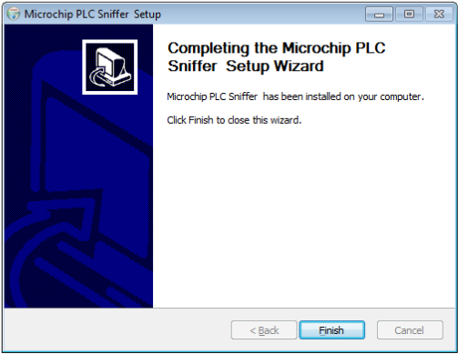
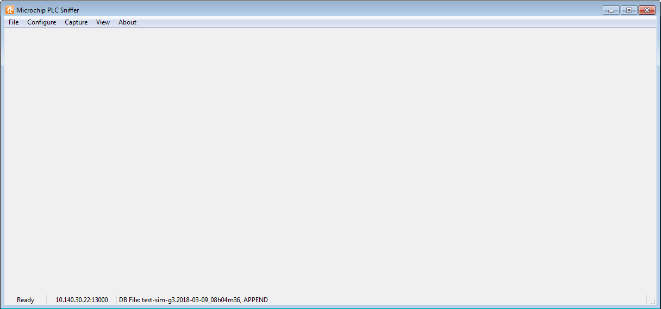
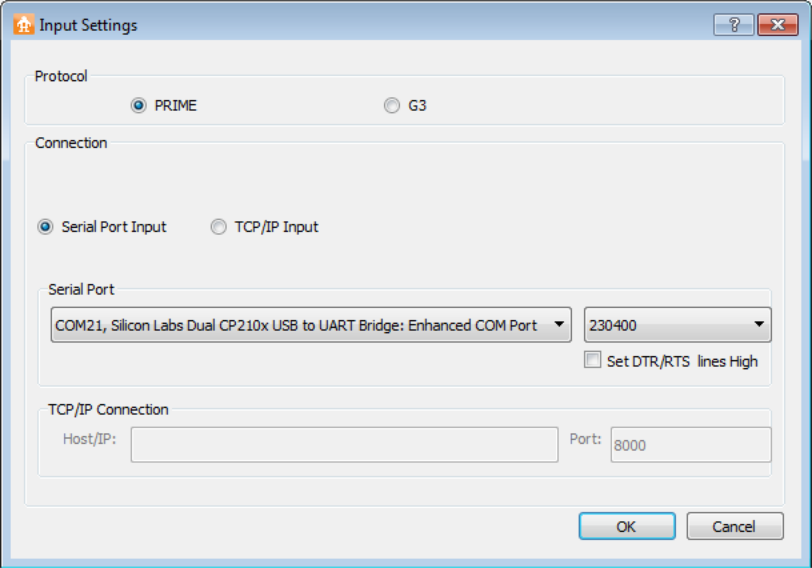
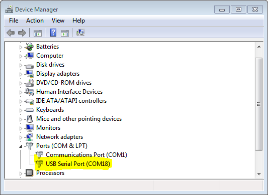
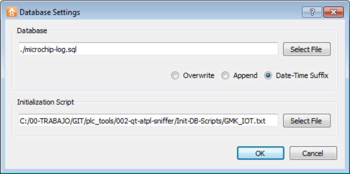

# Initial Steps

**Software Installation**

To install the software, execute the installation wizard provided. First window allows selecting between multiuser support and current user.

Read, and accept terms and conditions expressed in the End User License Agreement:

Next, select the components to install:

And finally, select the folder where the software must be installed or just simply use the default location:

The wizard will finish without any further configuration:

The installation procedure generates desktop and start menu shortcuts. Use any of them to start the software.

**Hardware Sniffer Device**

Along with the PLC Kit, you received the instructions to build the appropriate firmware using Atmel Studio or IAR tools. Build and program your embedded kit with the correct settings for your needs. It is important to note that the firmware configuration must match your hardware device.

**Starting the Sniffer**

The first step is to plug the hardware device to the power line. Then, connect the USB cable to the host computer. Now, we are ready to start the PLC Sniffer software using, for example, the link created on your desktop during the install process.

Now, you must see the main window:

In order to start capturing packets on the network, it is necessary to setup input and database parameters. Input parameters allow choosing between serial and TCP/IP link, as well as choosing between PRIME and G3-PLC standards. Set the appropriate settings for hardware sniffer.

If the COM port to choose is not known, it can be located in the Windows Device Manager in the Port \(COM & LPT\) section. In this example, the COM18 is used:

Once the input settings have been configured, it is necessary to setup the database file to store the traffic. This software uses SQLite to save all the packets snooped. Using SQLite allows performing complex searches and filters on the relational database.

It is also possible to select a TCP/IP input. This is useful to access remote hardware. For example, it could be possible to setup a relay station using connected embedded Linux board and *socat* software.

Database files can hold large logs without having to split them in pieces. Also files can be opened with any SQLite data analyzer tool, for example, the Mozilla Firefox plug-in SQLite Manager. It is possible to build your own scripts \(for example, in Python\) to analyze the data. Section [Building Your Own Scripts](GUID-E8D21C65-D545-4625-B32C-B6355F23BF83.md#) shows how to do this.

There are three options when creating a log database:

-   **Append:** Use this option if you wish to keep data already stored in the database file. If the selected file does not exist, a new database is created
-   **Overwrite:** Each time the capture is started, the database is initialized. Previously recorded data in the database will be lost
-   **Date-time suffix:** In this case, the file name supplied is modified adding a suffix with the date and time of the beginning of the log capture. Each time a new capture is started, a new file will be created with the corresponding date/time suffix

Database settings also allow selection of an initialization script. Leave it empty if you do not wish to modify the default behavior.

The initialization script will be executed right after a new database is created. This allows setting up of the database to a predefined state. There are a set of scripts supplied along with the PLC Sniffer that prepare the database to be able to decode all the messages sent in the Interoperability tests defined by the G3-PLC Alliance. These scripts are located in *\{Program\_Install\}/Init-DB-Scripts* folder.

At this point, the tool is ready to start capturing data. Click on the menu Capture → Start to begin logging data. The status bar at the bottom of the window will show the current setup and status of the tool.

**Parent topic:**[PHY Sniffer](GUID-8D66ECA9-8C74-42B9-8915-33D381579FBB.md)

