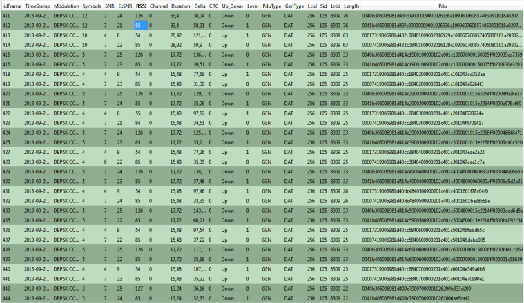

# Data Transfer

This is a sniffer capture of data transfer between the data concentrator and one Service Node with a switch between them:

If we analyze a basic data transfer, it is something like the following diagram:

**Parent topic:**[Appendix C. PRIMEv1.3 Use Case Examples](GUID-373ECDE6-AFFD-44B5-AE97-7CF1A8FCC4AD.md)

