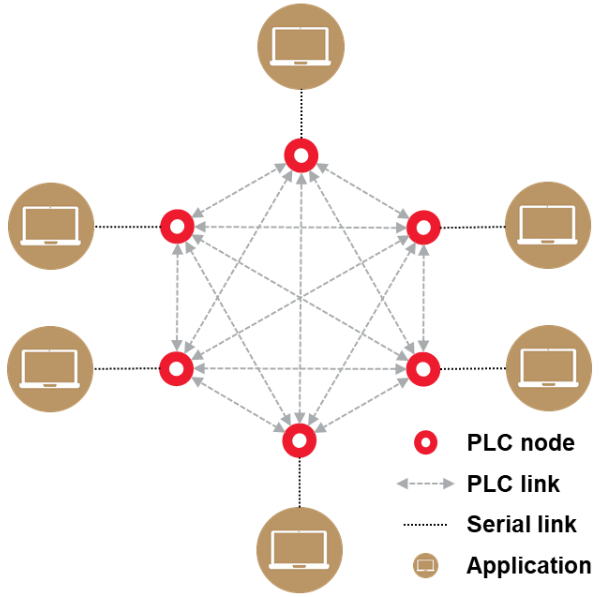

# PHY PLC & Go

PLC & Go is Microchip’s example to get started quickly with Power Line Communications \(PLC\). PLC & Go implements a basic application example of low data rate PLC \(up to 200 of kbps\) using OFDM modulation, that supports point to point and multi-point communications.

PLC & Go runs a chat application between two or more end points using Microchip PLC modem boards. The end points in this example are PCs which are connected via serial interface \(USB, UART\) to Microchip evaluation boards acting as PLC modems. Any end point can transmit a message, which is received by the other end points in the network. The application example allows end points to configure several PLC parameters such as modulation type, modulation scheme and band of transmission \(in case of using a Microchip evaluation board that supports several bands of transmission\).

PLC & Go chat application is built on top of the physical layer \(PHY\) of state-of-the-art standards for PLC, such as PRIME and G3-PLC. As such, PLC & Go is taking advantage of the speed, robustness and frequency band profiles defined by the PHY layers of these standards. For the sake of simplicity, PLC & Go removes all advanced networking features available in the MAC layers of PRIME and G3-PLC. These are not required for the basic point to point / point to multi-point communication scenarios described in this application note.

Microchip PLC solution is flexible and provides designs optimized for several frequency sub-bands below 500 kHz. Adopters can decide which band to use based on application’s restrictions and /or communications performance, which can be affected by different types of noise sources in the PLC channel.

-   **[Application Example](GUID-D8E2814E-98EA-4380-A781-862A488F5734.md)**  

**Parent topic:**[GUID-4E178A95-8CF8-4000-9884-63540E0CB241.md](GUID-4E178A95-8CF8-4000-9884-63540E0CB241.md)

