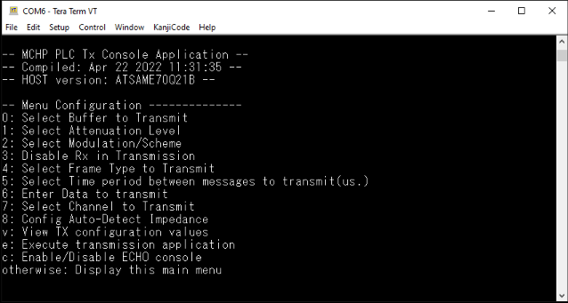
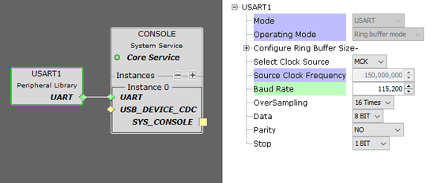

# PHY TX Console

Because of the timing restrictions in the connection with the PC, the PLC PHY Tester tool may present limitations in applications or tests that require a very short time interval between consecutive frame transmissions.

The PHY Tx Test Console is an application example that demonstrates the complete performance of the Microchip PRIME PHY Layer avoiding timing limitations in the PC host. That way, users can perform more specific PHY tests \(e.g., short time interval between consecutive frames\).

The PHY Tx Test Console application offers an interface to the user by means of a command console. In this console, users can configure several transmission parameters, such as modulation, frame data length and time interval between frames.

The example provided uses the console UART as a serial interface, configured through a certain UART or USB \(depending on platform\) at 115200 bps by default.

**Parent topic:**[GUID-4E178A95-8CF8-4000-9884-63540E0CB241.md](GUID-4E178A95-8CF8-4000-9884-63540E0CB241.md)

