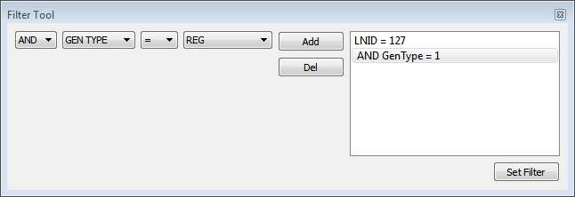

# PRIME Filter Window

The filter window \(only allowed in Log View mode\) allows selecting the frames shown in the main view table. Several parameters can be used to setup a filter:

-   LNID
-   Generic Type
-   Frame Id
-   Level
-   MAC
-   Timestamp
-   Up/down
-   Channel
-   LCID
-   SID
-   PDU type

Also a combination of different parameters can be created and applied. The filter then is transformed into a SQL statement used to query the database and retrieve the data shown in the table. [Figure   1](#FIG_IPW_5RM_SCB) shows the Filter Tool for selecting the frames in the database that have the LNID equal to 127 and a generic type of *Register*. This will select all register frames from nodes with the LNID equal to 127.

MAC filter performs a very complex query. It searches the database for each time a PRIME node registers itself with a Base Node and gets assigned an LNID. Also keeps track of PNPDUs frames. It cannot be used with other filters.

**Parent topic:**[PRIME](GUID-629FBCB3-9AE6-41A9-904E-39EBF5C9A78F.md)

