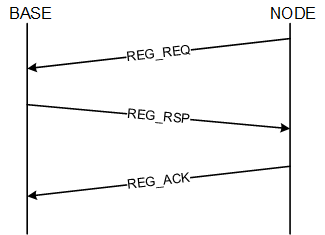
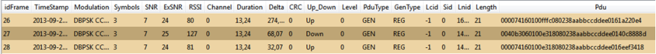
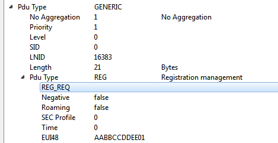
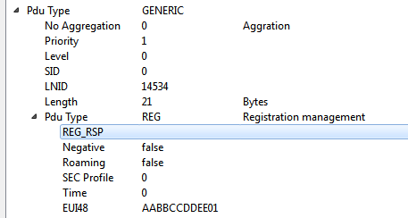
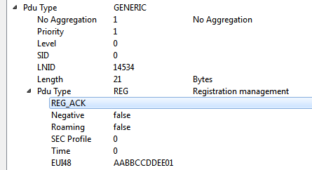

# SN Registration Request

The diagram for the registration process is the following:

In our sniffer capture window it is easy to identify the same process shown above. The next image shows the registration process with the 3 frames involved.

In order to obtain more details, you could go to the *packet view*. It is possible to find the type of messages and associate them with the previous diagram:

-   Frame 26:

    

-   Frame 27:

    

-   Frame 28:

    

**Parent topic:**[Appendix C. PRIMEv1.3 Use Case Examples](GUID-373ECDE6-AFFD-44B5-AE97-7CF1A8FCC4AD.md)

