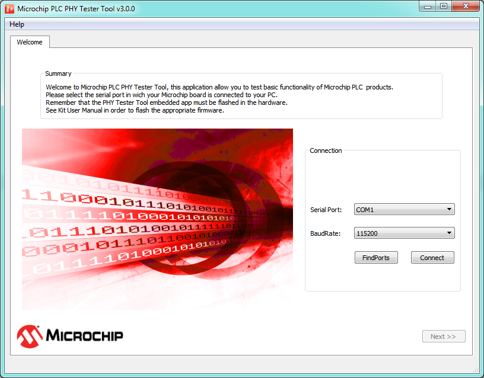
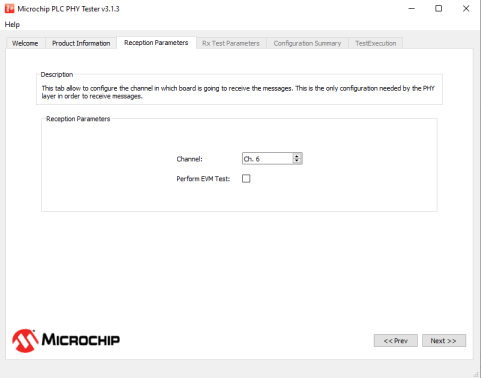
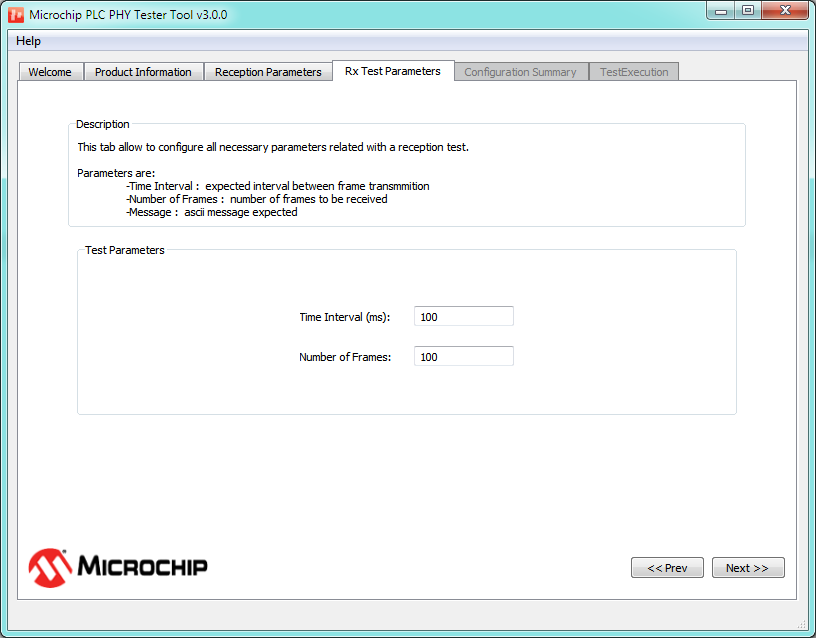
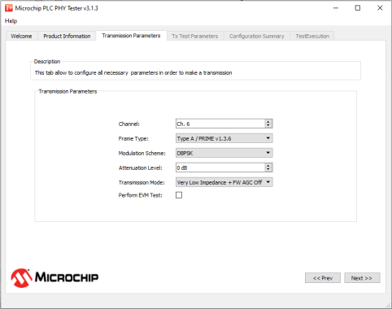
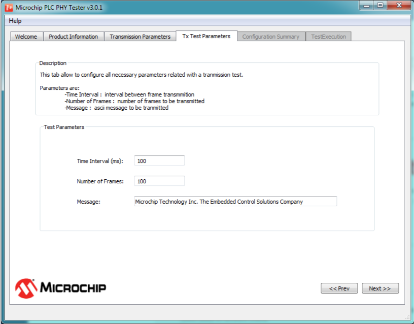
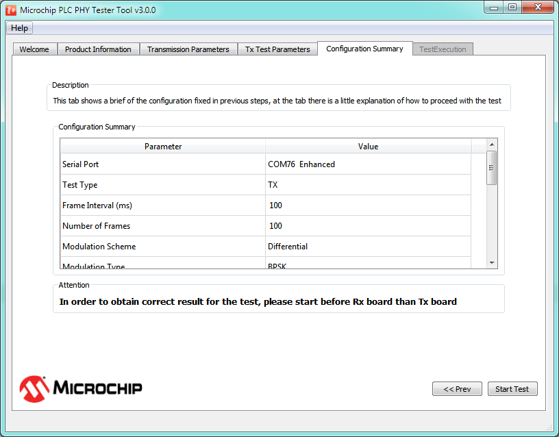

# General Operation

The first step is to plug the hardware device to the power line. Then, connect the USB cable to the host computer. Now we are ready to start the PLC PHY Tester software using, for example, the link created on your desktop during the install process. In order to work with PLC PHY Tester, the hardware must be flashed with the PHY Tester tool embedded application.

The PLC PHY Tester has been designed to work as a wizard commonly used by many desktop applications. The wizard is structured in tabs that are shown and enabled as the user sets configurations specific for each tab, and goes to the next tab by means of the proper button.

1.  **Welcome Tab**

    The main window that appears as soon as the application is started shows a welcome message and asks the user to select the serial port where Microchip PLC Development Board has been connected.

    

    The user must select the proper port and baudrate to connect and then press the “Connect” button. As soon as the button is pressed the button text changes to “connecting” triggering a process of board identification; after few seconds the button text changes to “Disconnect” which means that the identification process has finished. A new tab \(Product Information\) appears on the wizard and the “Next” button is enabled allowing the user to advance to the following step of the configuration. In case of error, please check the FW of the board and configuration of the serial connection.

2.  **Product Information Tab**

    As soon as the user presses the Next button in the Welcome tab, a new tab is shown:

    

    The Product Information tab shows basic board information and also asks the user to configure the board as transmitter or receiver.

    The information shown is related to the physical layer implemented in the firmware of the board:

    -   **Product ID:** Shows a text string identifying the Microchip PLC product \(platform\)
    -   **Model ID:** Is a 16-bits unsigned integer that identifies the model of the board
    -   **Firmware ID:** Is a 32-bits unsigned integer that identifies the physical layer firmware version running on the board
    The next tab depends on transmission or reception test selection. For reception tests “Reception Parameters” and “Rx Test Parameters” tabs are added; for transmission tests “Transmission Parameters” and “Tx Test Parameters” tabs are added. Finally, independently of the kind of test selected, two more tabs are added: “Configuration Summary” and “Test Execution”. All of these tabs are disabled at this point; as the user navigates through the wizard with the Next and Prev. buttons, the tabs become enabled.

3.  **Reception Parameters for PRIME PHY Layer**

    

    This tab allows the user to configure all parameters related with the reception of frames. Configurable parameters are as follows:

    -   The “Channel” option configures the physical channel where the PRIME Network is running
    -   The “Perform EVM Test” option changes message and interval of reception in order to make a test that evaluates the PHY layer performance. In test execution tab some extra columns are added in order to obtain more information about performance of the PHY layer.
4.  **Rx Test Parameters Tab**

    This tab allows configuration of the reception test parameters. These parameters are the amount of expected messages to be received and the time interval from message to message \(receiver instance will wait for this time prior to consider message is missed\). These parameters are used just for test statistic results. Unlike the previous one, this tab is common for all the Microchip PLC protocols. The following figure shows the tab layout:

    

5.  **Transmission Parameters for PRIME PHY Layer**

    

    This tab allows the user to configure all parameters related with the transmission of G3-PLC PHY frames. Configurable parameters are the following:

    -   Channel: Configures the channel where the PRIME Network is running
    -   Frame Type: Allows selection between Type A, Type B or Type BC
    -   Modulation Scheme: Modulation selection
    -   Attenuation Level: Configures the transmission power injected to the PRIME Network
    -   Transmission Mode: Configures the output stage depending on the line impedance seen by the board
    -   Perform EVM Test: Selecting this option changes the message and interval of transmission in order to make a test that evaluates the PHY layer performance.
6.  **Tx Test Parameters Tab**

    This tab is very similar to the Rx Test Parameters tab. The “Message” parameter allows configuration of the content of the message to be transmitted in ASCII characters. the “Time Interval” parameter defines the interval of time, measured in milliseconds, between the transmissions of two messages \(This time interval indicates the time between the beginnings of two frames\). Finally, the “Number of Frames” parameter allows configuration of the number of messages to be transmitted. As in the Rx Test Parameter Tab, this tab is independent of PHY layer.

    IMPORTANT: 10ms drifts in the transmission and reception times may appear due to the application running on a non-real time operating system.

    IMPORTANT: A "Time Interval" shorter than 70 milliseconds may not work properly due to PC OS and USB connection. Please use the PHY TX console firmware example to transmit messages with shorter time interval.

    

7.  **Configuration Summary Tab**

    This is the last tab in the wizard before starting the execution of the test. This tab shows a table where all the configuration parameters are listed that have been configured along the wizard. The “Next” button has been substituted with a “Start Test” button that allows starting the message transmission or reception.

    

8.  **Test Execution Tab**

    This is the tab shown while the test is being executed; it shows the transmission or reception of each message in form of a table. The following figures show examples of this tab for transmission and a reception tests:

    Both views \(Tx and Rx\) show tables representing different information depending on test type \(transmission/reception\). When the test is finished or is cancelled, a final report is shown at the bottom of the tab.

    This tab will provide additional information about signal quality in case of selecting "Performing EVM Test" check-box in the "Reception Parameters" tab.

    The user can copy the information included in the corresponding table to the clipboard by clicking on the "Copy Table" button. This tab is only able to hold the information of the last 10000 frames; the user can choose a bigger number of frames to be transmitted/received but only the last 10000 frames will be available.

9.  **Reception Test Results**

    

    Information included in the table is as follows:

    -   Frame \#: Indicates the received frame number
    -   Frame Type: Indicates the frame type: Type A, Type B and Type BC.
    -   Modulation Scheme: Indicates if modulation scheme
    -   SNR \(dB\): Signal-to-Noise ratio calculated as PRIME 1.4 Spec
    -   EVM \(dB\): Error Vector Magnitude calculated as PRIME 1.4 Spec
    -   RSSI \(dBuV\): Indicates the strength of the received signal in dBuV
    -   Data: Is the received info in ASCII format
    -   Rx Interval: Is the interval of time between the reception of the current frame and the previous one
    -   Payload Integrity: Shows if the content of the frame is correct or not
    After all frames have been received, or the test has been cancelled, a text box with information about the test will be shown at the bottom of the tab. First of all, test timestamps are shown; this information is measured by the PC application. After that, there is a section called Frame Error information that shows information about received frames and possible errors. Fields shown in this section are:

    -   Total Frames Received: Shows the number of frames detected, not taking into account if the frame has errors
    -   Total Frames Bad Header CRC: Shows the number of frames in which the header CRC8 is not valid. These frames are discarded by the firmware and are not reported in the application
    -   Total Frames Bad Header LEN: Shows the number of frames in which the header LEN is not correct. These frames are discarded by the hardware and are not reported in the application
    -   Total Frames Bad Payload: Shows the number of frames where the content of the payload is not what it is supposed to be
    -   Total Frames Received OK: Shows the number of frames received with the correct content
10. **Transmission Test Results**

    

    There are eight columns that show the following information:

    -   Frame \#: Indicates the number of frames transmitted. It is useful to track the test progress
    -   Tx Result: Indicates the result of the transmission. If an error occurs, a descriptive text will appear
    -   RMS\_Calc: This number is related with the impedance detected in the power line; it is used by the PHY layer to determine the transmission mode.
    -   Data: Shows the message received in ASCII format
    -   Tx Interval: Represents the time interval between the current frame and the previous one
    After all frames have been transmitted, a text box with information about the test will appear at the bottom of the tab.

    Test timestamps are provided; this information is measured by the PC application. After that, there is a section of information called Frame Error information that shows information about transmitted frames and possible errors. Finally, another section shows a summary of the transmission test; apart from known transmission parameters other parameters are shown:

    -   Frame Symbols: Is the duration in symbols of the frame
    -   Frame Duration: Is the duration in millisecond of the frame
    -   Tx Mean Interval: Is the average interval between transmissions calculated from top table data
    -   Effective Baudrate \(Peak\): Is the effective baudrate if frames were transmitted consecutively, calculated as follows:

        ||

    -   Effective Baudrate \(Real\): Is the effective baudrate, calculated as follows:

        ||

    -   Raw Baudrate \(Peak\): Is the baudrate taking into account all headers that previous baudrates have not considered if frames were transmitted consecutively, calculated as following

        ||

    -   Raw Baudrate \(Real\): Is the baudrate taking into account all headers that previous baudrates have not considered, calculated as following:

        ||

    -   Channel Usage : Is the percentage of channel that has been used, calculated as follows:

        ||

**Parent topic:**[PHY Tester Tool](GUID-86D38A8C-38A8-49D6-AF95-1E62D0A94EF2.md)

