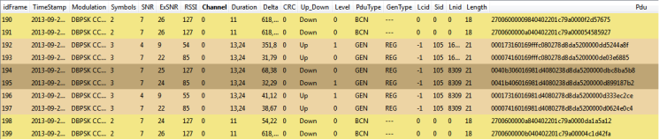
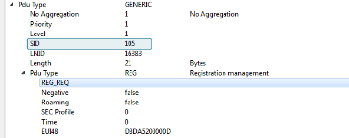
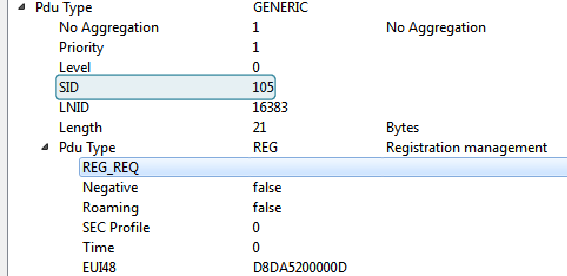
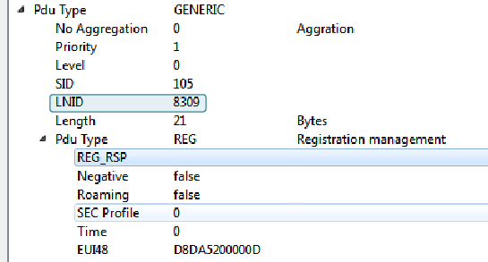
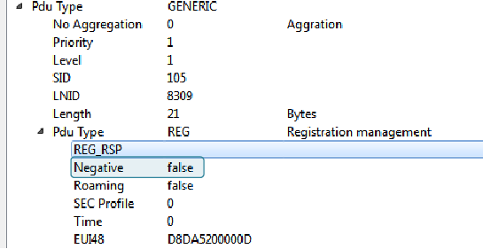
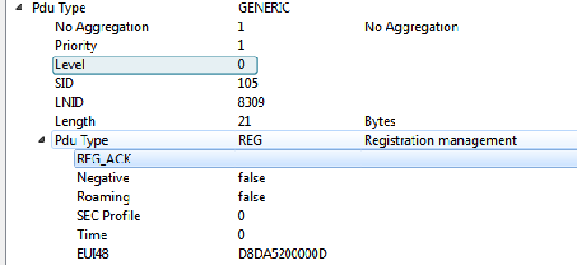

# SN Registration Request through a Switch

This is the diagram that appears in the PRIME specification 1.3.6 showing the registration process initialized by a Service Node through its switch:

In our sniffer capture window it is easy to identify the same process shown above. The next image shows the registration process with the 6 frames involved.

In order to obtain more details, if you go to the *packet view*, it is possible to find the type of messages and associate them with the previous diagram:

-   Frame 192:

    

-   Frame 193:

    

-   Frame 194:

    

-   Frame 195:

    

-   Frame 196:

    

-   Frame 197:

    

**Parent topic:**[Appendix C. PRIMEv1.3 Use Case Examples](GUID-373ECDE6-AFFD-44B5-AE97-7CF1A8FCC4AD.md)

