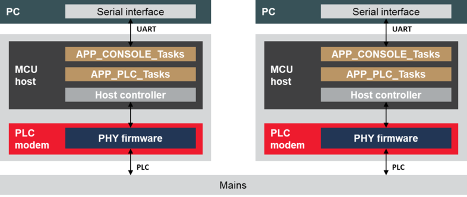
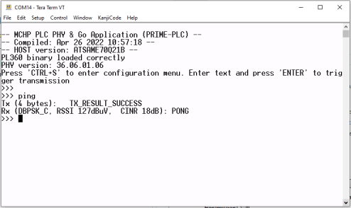

# Application Example

Microchip PLC & Go application is a point to multi-point chat application built on top of the PHY layer of state-of-the-art PRIME protocol.

Note that `phy_plc_and_go` application example can be used with Microchip PRIME stack version included on MPLAB Harmony in any Microchip platforms implementing PL360/PL460 device as PLC modem.

This application example assumes that a host device \(a PC, for example\) is connected through a serial interface \(USB, UART\) to a Microchip evaluation kit acting as a PLC modem.

The figure below provides an example of the minimum hardware and firmware resources required to run PLC & Go.

The PLC & Go application interchanges data with the PC through a serial port using a terminal emulator \(see figure PLC & Go console where terminal emulator TeraTerm is used\). The settings of the serial port are: 921600 bps, 8 data bits, no parity, 1 stop bit and flow control.

When the serial port is opened, the PLC & Go application shows in the console some information about the hardware platform and the firmware running, and it waits for a message to be sent. The message is sent when a carriage return character is received or the maximum length of the PLC data message is reached. If the user sends the ASCII character 0x13 \(‘CTRL+S’\), a configuration menu is shown.

The PLC & Go application allows to:

-   Configure modulation
-   Configure the TX/RX channel

In addition, the application provides some information about the transmitted messages \(length of the message\) and the received messages \(Modulation type, received signal strength indicator and carrier interference noise ratio\), which can be displayed by means of a terminal emulator in the PC.

In the example project, the `app_plc.c` file contains:

-   PLC initialization and configuration functions
-   Handlers for received messages, transmission and events

The `app_console.c` file contains the chat application which communicates with the PC using the serial port.

-   **[Initialization](GUID-9FCAE429-C7DF-46F9-A612-502134E591D2.md)**  

-   **[Transmission](GUID-23C1C481-5759-45DD-99E8-F29F74ABDB0D.md)**  

-   **[Reception](GUID-D6336496-D2D7-4FF9-A399-3451878B8E50.md)**  

**Parent topic:**[PHY PLC & Go](GUID-B538C5C8-9467-490F-95A6-13E59BB430FA.md)

