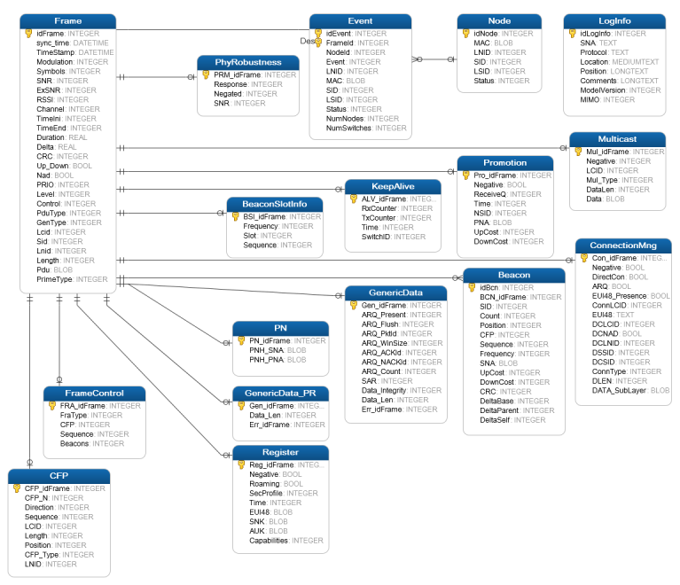

# Appendix A. PRIME SQLite Log Database

The PLC Sniffer creates a relational database using SQLite to store the PRIME logs. Using this type of database to store the information helps to handle logs from complex networks and to inspect the data in very flexible ways. Third party tools to handle SQLite databases can also be used. A useful tool for SQLite database inspection is the *SQLite Manager* plug-in for Firefox browser.

The current version of the database has 24 tables. New tables have been included since version 1.1.9 to accommodate changes in the new PRIME 1.4 version. This is the list of tables:

-   **LogInfo:** contains information about the database
-   **Frame:** each row of this table represents a PLC message on the power line. This table contains the information displayed on the Capture and Log windows. Includes the raw data of the received PDU and some parameters from the PHY Layer provided by the hardware. Also includes a timestamp value
-   **Beacon:** disassembled information of the Beacon PDU as defined in PRIME 1.3 standard
-   **Beacon1\_4:** disassembled information of the Beacon PDU as defined in PRIME 1.4 standard
-   **PN:** disassembled information of the Promotion Needed PDU as defined in PRIME 1.3 standard
-   **PN1\_4:** disassembled information of the Promotion Needed PDU as defined in PRIME 1.4 standard
-   **BeaconSlotInfo:** disassembled information of BeaconSlotInfo control PDU \(either PRIME 1.3 or 1.4\)
-   **CFP:** Content Free Period control PDU disassembled information \(PRIME 1.3 only\)
-   **ConnectionMng:** Connection Management control PDU disassembled information \(either PRIME 1.3 or 1.4\)
-   **FrameControl:** Frame Control PDU disassembled information for PRIME 1.3 standard
-   **FrameControl1\_4:** Frame Control PDU disassembled information for PRIME 1.4 standard
-   **GenericData:** Generic Data PDU information. Includes SAR and ARQ disassembled information and a data integrity check for PRIME 1.3 standard
-   **GenericData1\_4:** Generic Data PDU information. Includes SAR and ARQ disassembled information and a data integrity check for PRIME 1.4 standard
-   **KeepAlive:** Alive control PDU disassembled information \(only *KeepAlives* PRIME 1.3 are supported\)
-   **Multicast:** Multicast management control PDUs disassembled information. PRIME 1.3 standard
-   **Multicast1\_4:** Multicast management control PDUs disassembled information. PRIME 1.4 standard
-   **PhyRobustness:** Phy Robustness control PDUs disassembled information \(only in PRIME 1.3\)
-   **Promotion:** Promotion control PDUs disassembled information for PRIME 1.3 frames
-   **Promotion1\_4:** Promotion control PDUs disassembled information for PRIME 1.4 frames
-   **Register:** Register control PDU disassembled information as defined in PRIME 1.3 standard
-   **Register1\_4:** Register control PDU disassembled information as defined in PRIME 1.4 standard
-   **Security:** Security Information control PDU frames
-   **Event:** table containing network events detected: register, unregister, promotion, demotion, connection creation of nodes. Also stores the number of nodes and switches currently active on the network. Based on the information on this table, it is possible to trace the status for each node on the network
-   **Node:** table containing the current status of all the nodes detected on the network. Updated each time a new row is inserted on Event table. Keeps track of last known state of the PLC network

All tables are linked through a common “idFrame” index. This unique index is assigned when a new frame is inserted on the database. This allows building complex search queries with SQL. Table fields are encoded as specified in the PRIME standard.

[Figure   1](#FIG_KBV_ZYM_SCB) shows the tables and relations of a PRIME 1.3 log database. New PRIME 1.4 tables connect in similar way to the table Frame.



A few examples of queries are:

-   Select all frames after idFrame 31060 that belong to the device registered as 284 and all register frames:

    ```
    Select * from frame where idFrame >= 31060 and (lnid = 284 OR Gentype=1)
    ```

-   Select all *Register* and *KeepAlive* frames from device 284:

    ```
    Select * from frame where lnid = 284 and (GenType = 1 OR Gentype= 7)
    ```

-   Select all the register events for a node defined by a MAC address:

    ```
    Select * From Event Where Lnid IN (Select DISTINCT (lnid ) from Event WHERE MAC = X’001122334455’ AND SID IN (Select Distinct (SID) from Event Where MAC = X’001122334455’) AND Status = 4
    ```

-   Select Frames with LNID 35 and Promotion Needed frames for the node with MAC *001122334455*. Some PRIME concentrators may assign the same LNID to different nodes at different time. Therefore, this query might not return all the frames sniffed for a node:

    ```
    Select * From Frame Where Lnid = 35 UNION Select Frame.* From Frame, PN WHERE idFrame = PN_idFrame and PNH_PNA = X’001122334455’
    ```


**Parent topic:**[PHY Sniffer](GUID-8D66ECA9-8C74-42B9-8915-33D381579FBB.md)

