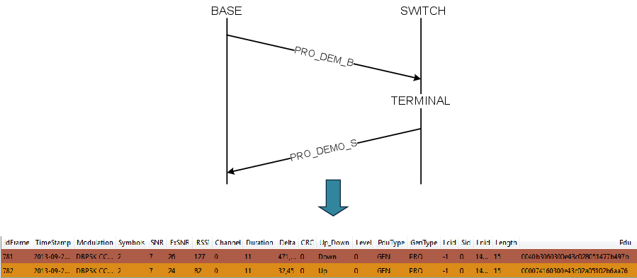
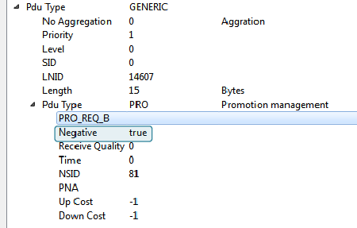
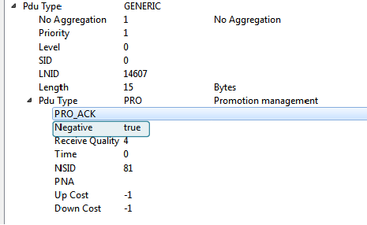

# Demotion Process Initialized by the Base Node

This is the diagram that appears in the PRIME specification 1.3.6 showing the demotion process initiated by the Base Node. It shows how the Base Node sends a demotion request to one switch via another switch.

The Base Node will send this demotion request to a switch when for example, that switch does not have any terminal connected to it. It has no sense having a switch without any terminal connected to it.

The sniffer capture below shows the demotion process initiated by the Base Node but in this case, there is not any intermediate switch, so there are only 2 devices involved: the Base Node and the switch.

In order to obtain more details, if you go to the *packet view*, it is possible to find the type of messages and associate them with the previous diagram:

-   Frame 781: Although the *Pdu Type* is PRO\_REQ\_B we know that is a demotion request because the parameter *Negative* is true. That means that it is the contrary process of a promotion request

    

-   Frame 782: Although the *Pdu Type* is PRO\_ACK we know that is a demotion ACK because the parameter *Negative* is true. That means that it is the contrary process of a promotion ACK

    

**Parent topic:**[Appendix C. PRIMEv1.3 Use Case Examples](GUID-373ECDE6-AFFD-44B5-AE97-7CF1A8FCC4AD.md)

