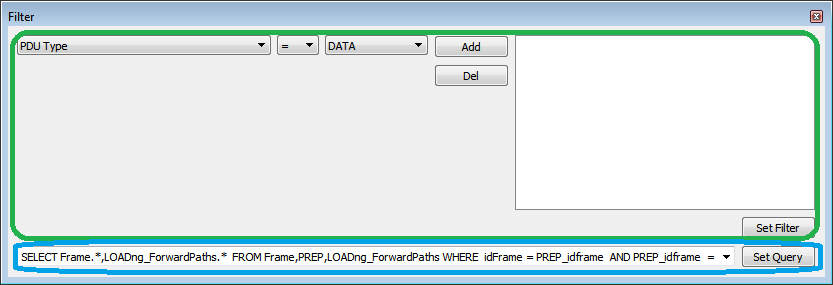
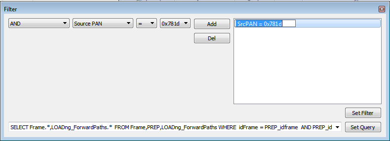

# G3-PLC Filter Tool

The filter window \(only allowed in Log View mode\) allows selecting the frames shown in the main view table. G3-PLC Filter tool window.

Several parameters can be used to easily setup a filter \(green area in [Figure   1](#FIG_ZZV_KWM_SCB)\):

-   Pdu Type
-   TimeStamp
-   Command Type
-   Source Pan
-   Destination Pan
-   Source Address
-   Destination Address
-   Frame Identifier
-   Modulation Type
-   Modulation Scheme

Filter parameters can also be manually edited. Double-click over the clause selected in order to modify the filter. [Figure   2](#ID-FIG-00000010) shows this step.

Complex filters can be created using SQL queries \(blue area in [Figure   1](#FIG_ZZV_KWM_SCB)\). This needs a better understanding of SQL, relational databases and how the sniffer database has been designed. Refer to section [Appendix B. G3-PLC SQLite Log Database](GUID-B1D36D7B-7A26-4B4E-B5DB-E314EF9CEF9F.md#) in order to learn about the database structure.

**Parent topic:**[G3-PLC](GUID-AEF828B2-7BEE-47DA-84FC-8959348255B2.md)

