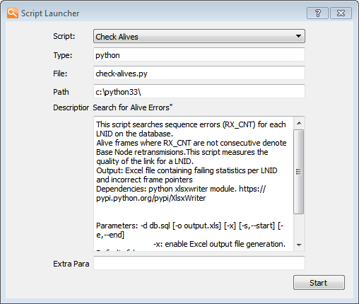

# Statistics/Script Launcher

Working with SQLite and Python is a very simple yet powerful way of analyzing the huge amounts of data gathered with the PLC Sniffer. In order to allow building this kind complex analysis of the database, an interface to call Python scripts from the PLC Sniffer has been included. Five different example scripts are included:

-   **Check Alives:** This script searches the whole database looking for non sequential alives for a node. Non sequential alives means Base Node retransmissions giving a glance of the overall link quality between the base and a node
-   **Availability:** measures the time that a node has been available \(i.e. registered state\)
-   **Alive Counter:** counts the number of alives produced in a time interval for a given level
-   **Decode Firmware Upgrade:** decoding generic data frames for the Firmware upgrade protocol
-   **Beacon Counter:** counts the number of beacons that an SID has emitted

These scripts need Python 3 \(tested with version 3.3\) with SQLite and XlsxWriter modules installed. Some scripts use the XlsxWriter module to generate a Microsoft Excel file containing the results of the query.

-   **[Building Your Own Scripts](GUID-E8D21C65-D545-4625-B32C-B6355F23BF83.md)**  

**Parent topic:**[PRIME](GUID-629FBCB3-9AE6-41A9-904E-39EBF5C9A78F.md)

